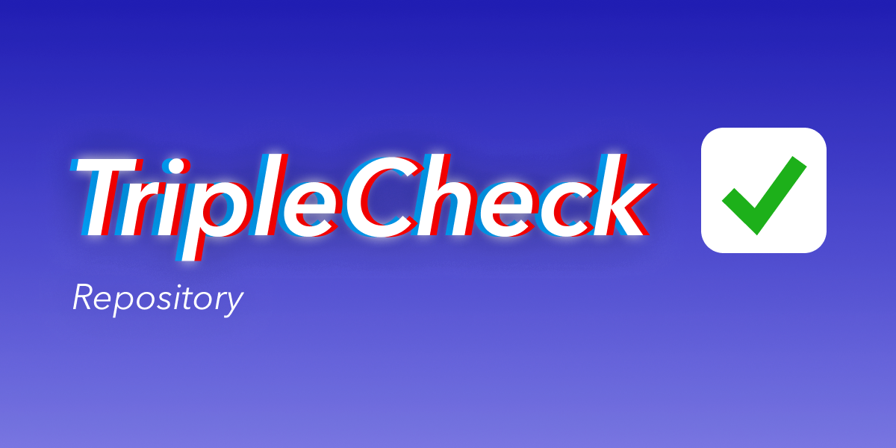

# triplecheck-repository-firestore



## TripleCheck: Firestore database repository

Database utility for using Firestore with TripleCheck broker. It implements the repository base at [triplecheck-core](https://github.com/mikaelvesavuori/triplecheck-core).

## Instructions

In your `triplecheck-broker` implementation, do a regular import for `triplecheck-repository-firestore` and pass the repository to the broker. A basic implementation could look like:

```TypeScript
import { FirestoreRepository } from 'triplecheck-repository-firestore';
import { TripleCheckBroker } from 'triplecheck-broker';

// If inside Google Cloud Platform:
// Pass the repo your Firestore configuration and the collection name
const repository = FirestoreRepository(undefined, "your-database-name");

// If outside Google Cloud Platform:
// Pass the repo your Firestore configuration and the collection name
// Keyfile/config only needed when running outside of GCP context
// @see https://cloud.google.com/firestore/docs/quickstart-servers
const repository = FirestoreRepository({
  projectId: 'your-project-id',
  keyFilename: 'keyfile.json'
}, "your-database-name");

const request = "Get this from your API request and transform it as needed";
const payload = "Body";

const { responseData, status, headers } = await TripleCheckBroker(
  request,
  payload,
  repository
);
```
